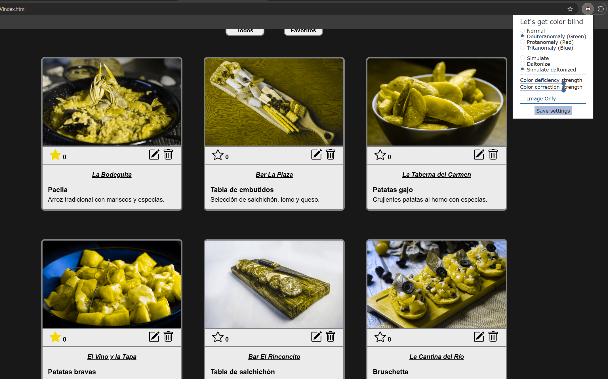
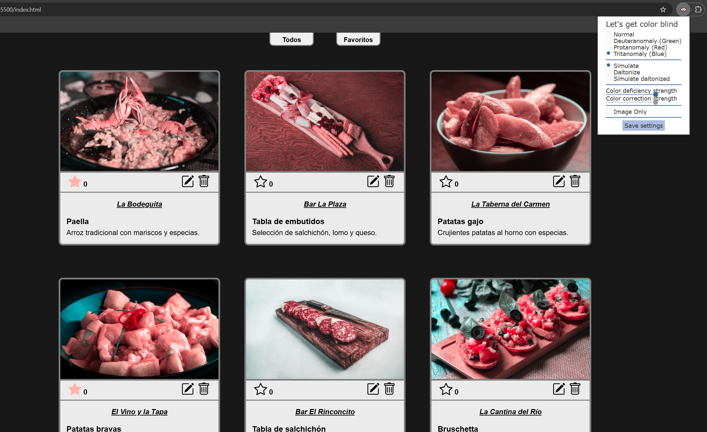

# galeria-tapas

El carrusel cambia de imágenes automáticamente, y a voluntad del usuario con las flechas laterales y los botones inferiores.

Las imágenes usadas pertenecen a pexels.com y pixabay.com, que permiten una licencia de uso gratuito sin atribución y con modificación para fines no comerciales.
Licencias:
https://www.pexels.com/es-es/license/
https://pixabay.com/es/service/license-summary/

Para optimizar las imágenes hemos utilizado un formato .webp. Para convertir las imágenes hemos usado https://convertio.co/es/ y para escalarlas a diferentes resoluciones hemos usado https://products.aspose.app/imaging/es/image-resize/webp

Para la galería hemos hecho un grid adaptativo para diferentes tamaños máximos de pantalla, para que sea visible en diferentes dispositivos. El carrusel también se adapta a diferentes tamaños. Todas las imágenes tienen carga perezosa.

Para el logo y los iconos del footer se han usado imágenes vectoriales. El logo fue generado con IA, adaptado con Photoshop y convertido a svg con https://convertio.co/es/

La estética general es simple, en escala de grises y fondo oscuro, con los elementos de la galería en color contrastante.

-----------------------------------------------------------------------------------

# Galería interactiva con DOM:

La galería se genera dinámicamente utilizando DOM, estando los datos en un JSON que se carga en un array en memoria, y las operaciones de editar, eliminar y añadir se ejecutan sobre este array.

Hemos añadido botones para añadir y quitar favoritos, que se alternan según si ya están marcados o no, y se pueden filtrar para poder mostrar todas las tapas o solo las marcadas como favoritas.
También se han añadido botones de editar y eliminar cada tapa. En caso de editar la tapa, ambos botones se sustituyen por guardar y cancelar cambios respectivamente, y el bar, título y descripción de la tapa se cambiarán a campos de texto (reemplazando cada texto por su campo usando DOM) para ser editados en su mismo sitio. Al guardar o cancelar, los campos de texto vuelven a ser texto plano, modificándose si se han guardado los cambios o volviendo al texto original si se han cancelado.
Los botones de cada tapa se muestran y se esconden añadiendo o eliminando una clase mediante DOM.

Se ha añadido una opción para añadir nuevas tapas después de la galería. Al pulsar el botón para añadir una nueva tapa, se redirige a una nueva pestaña en la que introducir la información de la tapa, con un campo para el título de la tapa, descripción y nombre del bar. También hay un campo opcional para el nombre de archivo de imagen (ejemplo: tapa13.webp). Si no se introduce una imagen, se mostrará una por defecto.

La galería conserva la estética original, añadiendo una sección bajo la foto de cada tapa con los distintos botones, dos botones de filtrado antes de la galería y una sección al final de la galería para añadir una nueva tapa, siguiendo lo anteriormente hablado. Se han usado siete imagenes vectoriales nuevas para estos botones, los cuales tienen un efecto de cambio de color según su función al pasar el puntero sobre ellos.

-----------------------------------------------------------------------------------

# Estudio Usabilidad:

1. En pantallas pequeñas en las que la galería se adapta a una columna de ancho, se produce un scroll infinito en la galería. Solución: hemos añadido botones de paginación al final de la galería para mostrar las tapas de 6 en 6. Se ha implementado usando JavaScript.
2. La opción para añadir tapa estaban muy abajo, después de la galería. Solución: hemos movido esta opción a la barra de navegación del header.
No existía confirmación al eliminar una tapa. Solución: hemos añadido un modal de confirmación al pulsar el icono de borrar una tapa.
3. El significado del botón de cancelar cambios al editar la tapa podía no ser del todo claro al tener forma de flecha. Solución: ahora se usa el mismo icono pero en forma de cuadrado, similar al anterior pero con un significado más fácilmente entendible.
4. No había opción de cancelar al añadir nueva tapa. Solución: hemos añadido botón secundario en el formulario para añadir una tapa nueva que sirve para cancelar y volver a la galería.
5. La página de añadir nueva tapa no tenía gran consistencia con la principal. Solución: se han ajustado los estilos para hacer las dos páginas más consistentes, y se han mejorado las interfaces de ambas.

### En desarrollo:

- No hay control de usuario, hasta que se implemente el login y registro.
- Queda por implementar el control de errores en el formulario de añadir nueva tapa.
- El nombre de los bares se edita mediante un campo de texto, pero más adelante (al implementar la API) se sustituirá por un desplegable y tendrá una opción para editar el bar.
- La página de añadir nueva tapa es una página separada. Se implementará como una ventana modal al pulsar el botón para añadir nueva tapa.

En general, se han seguido heurísticas como: consistencia, prevención de errores, diseño minimalista, colores contrastantes, uso de metáforas, etc.

-----------------------------------------------------------------------------------

# Diseño Adaptativo:

En las resoluciones más grandes (>1350px), la galería se dividirá en 3 columnas, en resoluciones de 1349px a 880px se dividirá en 2 y en resoluciones menores en 1. La resolución y tamaño de las imágenes del carrusel también se adapta a esas 3 resoluciones.
Además de ajustarse las columnas, el tamaño de las tarjetas de cada tapa y el carrusel se adaptan a tamaños intermedios.
Los textos usan unidades "rem", por lo que tienen un tamaño responsivo.
Las barras de búsqueda adaptan su ancho a la resolución de la pantalla.
Se ha usado bootstrap para la navbar, el carrusel y la modal de eliminación.

-----------------------------------------------------------------------------------

# Mejora de Accesibilidad:

## Análisis de Accesibilidad Basado en las WCAG 2.2:

Principio 1: Perceptible
- 1.3.4 Orientación (AA)

Principio 2: Operable
- 2.3.2 Tres flashes (AAA)

Principio 3: Comprensible
- 3.2.1 En foco (A)

## Evaluación Manual de la Interfaz Actual:

Para comprobar si la página da problemas a personas con movilidad reducida, hemos comprobado que ninguna acción requiera multitouch y que todas las funcionalidades sean accesibles con teclado.

Se arreglarán los botones de la galería (favorito, editar y eliminar), ya que no son accesibles mediante el teclado.

Para comprobar si la página da problemas a personas con daltonismo, hemos usado la extensión "Let's get colorblind", y hemos probado los diferentes tipos de daltonismo.
La galería es fácilmente entendible para todos, todos los elementos contrastan claramente y se identifican sin problemas.

En el caso de un usuario que no perciba el color rojo, los errores de la parte del registro pueden parecer bastante oscuros, por lo que cambiaremos el color de los errores por uno más claro.